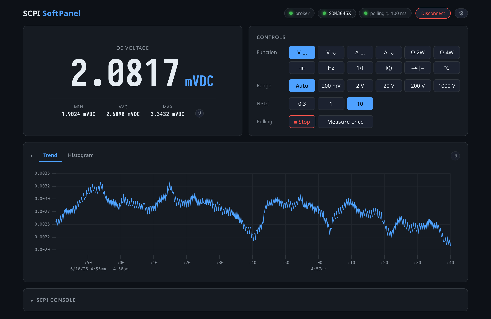

# SCPI SoftPanel

A control panel for SCPI bench instruments that have no web UI of their own — built
first for a **Siglent SDM3045X** bench multimeter, which exposes raw SCPI over TCP
(port 5025) but serves no UI.

It ships two ways from one codebase:

- **Desktop app** for Windows, macOS, and Linux — download, run, point it at your
  instrument.
- **Headless server** for an always-on LAN host — serves the same UI to any browser.



Live readout, a front-panel-style function keypad, range / NPLC / continuity-threshold
controls, a trend chart, a raw-SCPI console, and a continuity tone.

## Download

Desktop app — these links always point at the latest release:

- **Windows** — [**SCPI-SoftPanel-windows-x64.msi**](https://github.com/tinic/scpi-softpanel/releases/latest/download/SCPI-SoftPanel-windows-x64.msi)
  (or the [`.exe` setup](https://github.com/tinic/scpi-softpanel/releases/latest/download/SCPI-SoftPanel-windows-x64-setup.exe))
- **macOS (Apple Silicon)** — [**SCPI-SoftPanel-macos-apple-silicon.dmg**](https://github.com/tinic/scpi-softpanel/releases/latest/download/SCPI-SoftPanel-macos-apple-silicon.dmg)
- **macOS (Intel)** — [**SCPI-SoftPanel-macos-intel.dmg**](https://github.com/tinic/scpi-softpanel/releases/latest/download/SCPI-SoftPanel-macos-intel.dmg)
- **Linux** — `.deb` / `.rpm` / `.AppImage` on the [latest release](https://github.com/tinic/scpi-softpanel/releases/latest), or run the [Docker image](#quick-start-docker)

Builds are **unsigned**, so the first launch shows an OS warning — see
[unsigned builds & self-signing](#unsigned-builds--self-signing) for the one-time steps.

## Quick start (Docker)

Run the headless server from the prebuilt image — no clone, no build. Save this as
`docker-compose.yml` (it's also in the repo root) and `docker compose up -d`:

```yaml
services:
  scpi-softpanel:
    image: ghcr.io/tinic/scpi-softpanel:latest
    restart: unless-stopped
    ports: ['8080:8080']
    environment:
      METER_HOST: '' # your instrument's IP, or leave empty to set it in the UI
      METER_PORT: '5025'
    volumes: ['scpi-data:/data']
volumes:
  scpi-data:
```

Then open <http://localhost:8080> and point it at your instrument (the gear icon, or
the `METER_HOST` env above). Settings persist in the `scpi-data` volume.

Or without a compose file:

```bash
docker run -d -p 8080:8080 -v scpi-data:/data \
  -e METER_HOST=192.168.1.50 ghcr.io/tinic/scpi-softpanel:latest
```

Images are published to GHCR for `linux/amd64` + `linux/arm64` on every release. Prefer
a native desktop app? Grab an installer from the [releases](../../releases) (see
[unsigned builds & self-signing](#unsigned-builds--self-signing)).

## Architecture

```
            ┌─────────────── scpi-core (Rust) ───────────────┐
browser  ⇄  │  Axum HTTP/WS  ·  meter state machine + poller  │  ⇄  instrument
(Vue 3)     │                ·  raw-socket SCPI client        │     (TCP 5025)
            └────────────────────────────────────────────────┘
                  ▲                              ▲
           scpi-server (headless bin)     scpi-desktop (Tauri app,
           LAN host, serves the UI         embeds the UI + server,
           on :8080)                       webview → 127.0.0.1)
```

- **One Rust core** (`rust/scpi-core`) does everything: a raw-socket SCPI client
  (plain TCP — no VXI-11/RPC, no VISA), the meter state machine + poll loop, the
  reading-history ring, and the wire contract shared with the frontend.
- **`rust/scpi-server`** wraps it in an Axum HTTP/WS server and serves the built web
  UI — the always-on LAN deployment.
- **`rust/scpi-desktop`** is a Tauri app that embeds the same server (on an ephemeral
  `127.0.0.1` port) and the Vue bundle, and points a webview at it — a single
  self-contained executable. The frontend is byte-identical in both.
- The **Vue 3 frontend** (`apps/web`) talks WebSocket + REST to the core, with shared
  zod contracts in `packages/shared`.

The instrument allows a single control session, so the core holds exactly one and
serializes everything through it. A **Disconnect** button closes the socket so the
meter is free for front-panel use (the SDM3045X has no remote→local SCPI command;
press its Run/Stop key to return to local).

## Layout

```
apps/web          Vue 3 + Vite UI: live readout, controls, uPlot trend, SCPI console
packages/shared   TS contracts (zod → types) shared by the web UI
rust/scpi-core    SCPI client, meter state machine, poller, ring, wire contract
rust/scpi-server  headless Axum HTTP/WS server (LAN deployment)
rust/scpi-desktop Tauri desktop app (embeds core + server + UI)
```

## Develop

Requires Node 20+, pnpm, and a Rust toolchain.

```bash
# Terminal 1 — the core/server against your instrument (serves API + WS on :8080)
cd rust
METER_HOST=192.168.1.166 cargo run -p scpi-server

# Terminal 2 — the Vite dev server (proxies /api + /ws to :8080)
pnpm install
pnpm dev          # http://localhost:5173
```

For the desktop app (needs the Tauri prerequisites for your OS):

```bash
pnpm --filter @scpi/web build          # the app embeds this bundle at compile time
cd rust/scpi-desktop && cargo tauri dev
```

## Build & ship

```bash
# Headless server (LAN): build the UI, then the binary.
pnpm --filter @scpi/web build
cd rust && cargo build --release -p scpi-server
WEB_DIST=../apps/web/dist METER_HOST=192.168.1.166 ./target/release/scpi-server  # :8080

# Desktop installers (.deb/.rpm/.AppImage on Linux; .msi/.dmg on Windows/macOS):
pnpm --filter @scpi/web build
cd rust/scpi-desktop && cargo tauri build

# Container (headless server):
docker build -t scpi-softpanel .
docker run --rm -p 8080:8080 -e METER_HOST=192.168.1.166 -v scpi-data:/data scpi-softpanel
```

Cross-platform desktop installers are produced by CI (`.github/workflows/desktop-release.yml`)
on pushing a `v*` tag — Windows/macOS/Linux artifacts attach to a draft GitHub Release.

## Unsigned builds & self-signing

The released installers are **unsigned** — a warning-free install needs a paid Apple
Developer ID ($99/yr) and Azure Artifact Signing (~$10/mo), which isn't worth it for a
hobby tool. The apps still run; you just have to get past a one-time OS warning, or
self-sign for your own machines. (Linux needs nothing.)

**Linux** — nothing to do. The `.deb`/`.rpm`/`.AppImage` install and run as-is.

**macOS** — the download is quarantined and Gatekeeper blocks it. Clear the quarantine
flag once:

```bash
xattr -dr com.apple.quarantine "/Applications/SCPI SoftPanel.app"
```

On Apple Silicon an app with _no_ signature is refused as "damaged", so ad-hoc sign it
(a local-only signature — valid on your Mac, not notarized, no Apple account needed):

```bash
codesign --force --deep --sign - "/Applications/SCPI SoftPanel.app"
```

Or just right-click the app → **Open** the first time and confirm the dialog.

**Windows** — SmartScreen shows "Windows protected your PC"; click **More info → Run
anyway**. To also drop the "Unknown publisher" prompt on your own machines, self-sign and
trust the cert (elevated PowerShell):

```powershell
# 1. Create a self-signed code-signing certificate
$cert = New-SelfSignedCertificate -Type CodeSigningCert `
  -Subject "CN=SCPI SoftPanel (self-signed)" -CertStoreLocation Cert:\CurrentUser\My

# 2. Sign the installer (adjust the signtool path / msi name)
& "${env:ProgramFiles(x86)}\Windows Kits\10\bin\x64\signtool.exe" `
  sign /fd SHA256 /sha1 $cert.Thumbprint "SCPI SoftPanel_x64_en-US.msi"

# 3. Trust it on each machine that will run the app
Export-Certificate -Cert $cert -FilePath scpi-softpanel.cer
Import-Certificate -FilePath scpi-softpanel.cer -CertStoreLocation Cert:\LocalMachine\Root
Import-Certificate -FilePath scpi-softpanel.cer -CertStoreLocation Cert:\LocalMachine\TrustedPublisher
```

A self-signed signature only counts on machines that trust the cert, and it never earns
SmartScreen reputation — only a CA-issued certificate does that. `desktop-release.yml`
already has the slots to plug in real signing secrets later.

## Configuration

The meter target is settable at runtime from the UI (the gear → Instrument), persisted
per-user. Defaults come from the environment (see `.env.example`): `METER_HOST`,
`METER_PORT` (5025), `METER_TIMEOUT_MS`, `POLL_INTERVAL_MS`, `POLL_AUTOSTART`,
`RING_CAPACITY`, `PORT`, `HOST`, `WEB_DIST`, `CONFIG_PATH`.

## Checks

```bash
pnpm lint && pnpm typecheck && pnpm test && pnpm build && pnpm format   # web
cd rust && cargo fmt --all --check && cargo clippy --all-targets && cargo test
```

## Refreshing the screenshot

`docs/screenshot.png` is captured from the live app by `scripts/screenshot.mjs` (drives
the cached Playwright Chromium headless — no system browser needed). With the server
running and connected to a meter:

```bash
node scripts/screenshot.mjs            # → docs/screenshot.png (1280px @2x)
node scripts/screenshot.mjs <url> <out>
```
